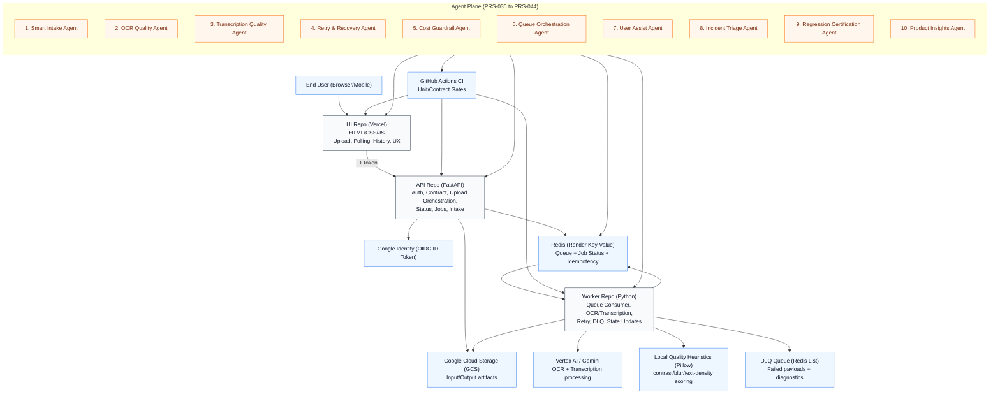
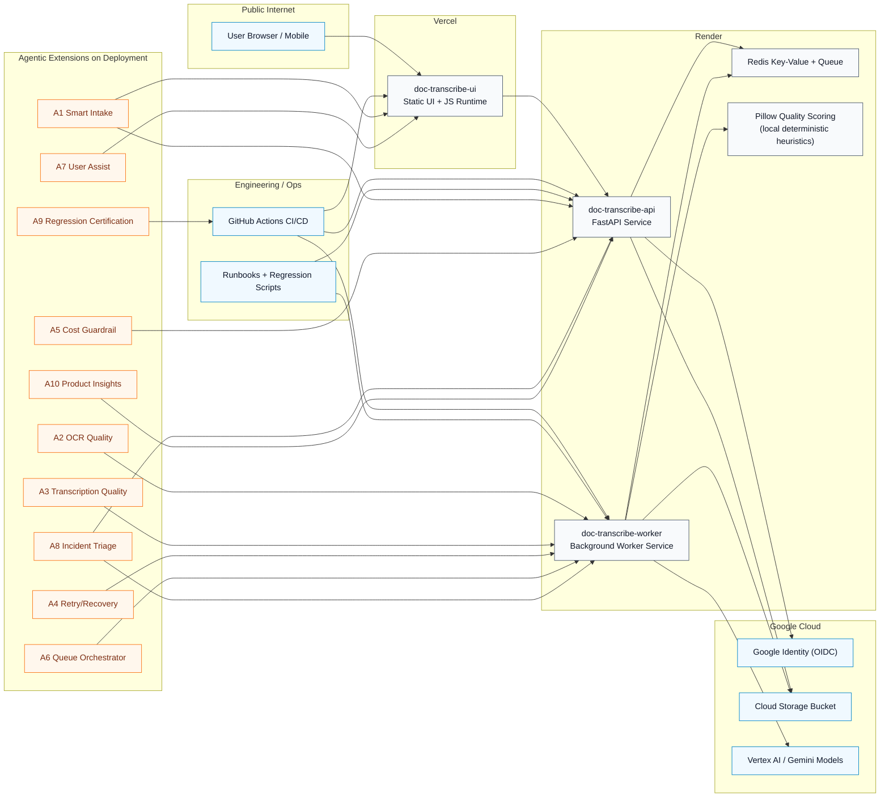
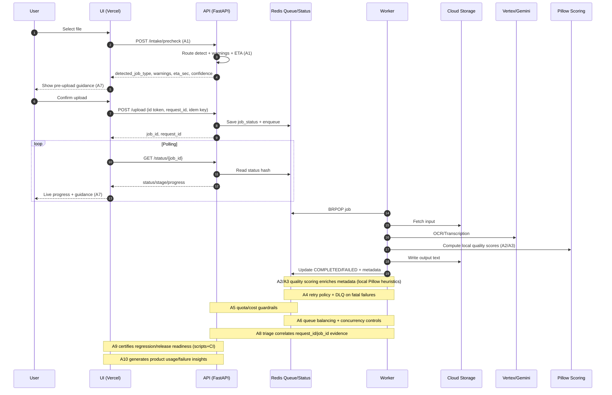

# Building a Production-Ready OCR + Transcription Platform with Agentic AI (UI + API + Worker)

This is a practitioner-focused walkthrough of how I designed and hardened a 3-repo platform for:
- `PDF/Image -> Hindi Text (OCR)`
- `Audio/Video -> Hindi Text (Transcription)`

Production UI: [https://doc-transcribe-ui.vercel.app/](https://doc-transcribe-ui.vercel.app/)

The platform is built as:
- UI repo: `doc-transcribe-ui` (Vercel-hosted front-end)
- API repo: `doc-transcribe-api` (FastAPI orchestration + contracts + auth + status)
- Worker repo: `doc-transcribe-worker` (queue consumer + OCR/Transcription execution)

---

## 1) Why this problem matters

Users do not just need “AI output”. They need:
- predictable experience before upload,
- transparent progress during processing,
- reliable completion/error behavior,
- fast support turnaround when anything fails.

So the focus was not only model integration, but full-stack production readiness: architecture boundaries, contracts, observability, retries, idempotency, security, regression gates, and now agentic extensions.

---

## 2) Functional Requirements (FR)

Core FRs implemented across the 3 repos:
1. Google-authenticated sign-in and session restore.
2. Upload support for OCR (`pdf/image`) and transcription (`audio/video`).
3. Async job lifecycle: `QUEUED -> PROCESSING -> COMPLETED/FAILED/CANCELLED`.
4. Real-time progress polling + stage updates.
5. Downloadable output artifacts.
6. Job history with filtering/pagination and metadata.
7. Cancellation and retry behavior.
8. Deterministic error messaging with stable error codes.
9. Pre-upload guidance (Smart Intake stories): route detection, warnings, ETA (feature-gated rollout).

---

## 3) Non-Functional Requirements (NFR)

NFRs intentionally engineered:
1. **Reliability**: guarded state transitions, retry with backoff+jitter, DLQ enrichment.
2. **Observability**: structured logs, mandatory fields (`request_id`, `job_id`), stage logs, metrics.
3. **Maintainability**: layer boundaries, modularization, canonical contract, contributor standards.
4. **Scalability**: queue partitioning, worker concurrency controls, load baseline scripts.
5. **Security**: strict token validation (`iss/aud/exp/nbf/azp`), CORS allowlist, file validation.
6. **Cost governance**: limits/quotas, retry budgets, user-facing effort/cost hints.
7. **Operability**: readiness checks, runbooks, feature flags for controlled rollout.
8. **Quality governance**: unit/integration tests, local/cloud bounded regression, CI gates.

---

## 4) Logical / Layered Architecture (with all external systems + all 10 agents)



---

## 5) Deployment Architecture Diagram



---

## 6) Design Flow Diagram (Request lifecycle + agent touchpoints)



---

## 7) Architecture and design choices that mattered

1. **Canonical contract first**
- One source of truth for job/status fields reduced UI/API/Worker drift.

2. **Idempotency + deterministic error envelopes**
- Crucial for handling retries and user trust.

3. **Observability by design**
- Correlation IDs, stage logs, and metrics turned “unknown failures” into diagnosable incidents.

4. **Feature-flagged rollout**
- Smart Intake was shipped safely without breaking legacy behavior.

5. **Regression as a product capability**
- Local and cloud bounded regression reduced release risk materially.

6. **Quality scoring kept local-first (non-LLM)**
- OCR/transcription quality scores are designed to be computed locally via Pillow/text heuristics for fast, cheap, stable behavior.
- LLM-based quality scoring remains an optional future enhancement, not a current dependency.

---

## 8) User impact summary

What improved for end users:
- clearer expectations before upload,
- fewer avoidable failures,
- more stable status/progress UX,
- better error clarity and support turnaround.

What improved for engineering/ops/product:
- cleaner architecture boundaries,
- faster root-cause analysis,
- predictable rollout/rollback,
- stronger confidence in release quality.

Sample quality payload (local deterministic scoring):
```json
{
  "ocr_quality_score": 0.78,
  "low_confidence_pages": [2, 5],
  "quality_hints": [
    "Page 2: low contrast detected",
    "Page 5: image appears blurry"
  ],
  "quality_method": "pillow_local_heuristics_v1"
}
```

---

## 9) What’s next

Near term:
- complete remaining agent stories for `PRS-035` to `PRS-044`.
- operationalize quality, triage, and certification agents.
- keep quality scoring deterministic first (Pillow-based), then optionally add LLM scoring as an enrichment layer.

Strategic:
- move to `PRS-045`: Digambar Jainism GPT using RAG, reusing this reliability and observability foundation.

---

## 10) Suggested visual export workflow (for actual image files)

If you need PNG/SVG assets for LinkedIn carousel:
1. Render Mermaid blocks from this markdown in VS Code/Markdown preview.
2. Export each diagram as PNG/SVG.
3. Optionally annotate in Figma/Excalidraw for publication-ready branding.
